# TokoKita

Sellyjuan Alya R / H1D023006
Shift A/C

Ringkasan singkat
TokoKita — aplikasi demo toko (Flutter).


Fitur yang disertakan
- Halaman registrasi dan login (form, validasi sederhana)
- CRUD produk UI (tambah, ubah, list, detail)


Struktur penting
```
lib/
	main.dart
	model/
		login.dart
		registrasi.dart
		produk.dart
	ui/
		login_page.dart
		registrasi_page.dart
		produk_page.dart
		produk_form.dart
		produk_detail.dart
```


Tampilan :

### Proses Registrasi

a. Form Registrasi (isi & validasi)

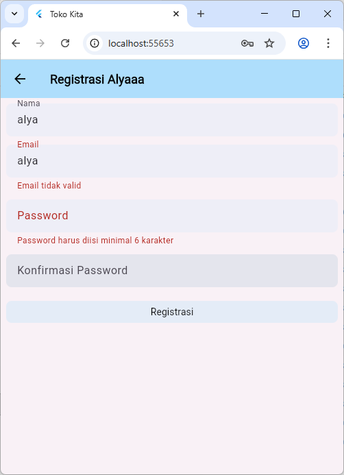

- Isi Nama (min. 3 karakter), Email (format valid), Password (min. 6 karakter), dan Konfirmasi Password (harus sama).
- Jika format tidak sesuai, pesan validasi akan tampil di bawah field.
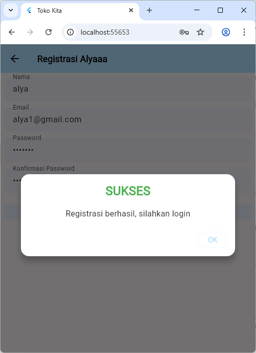

### Proses Login

a. Form Login (isi form)


- Menginputkan email dan password pada form.
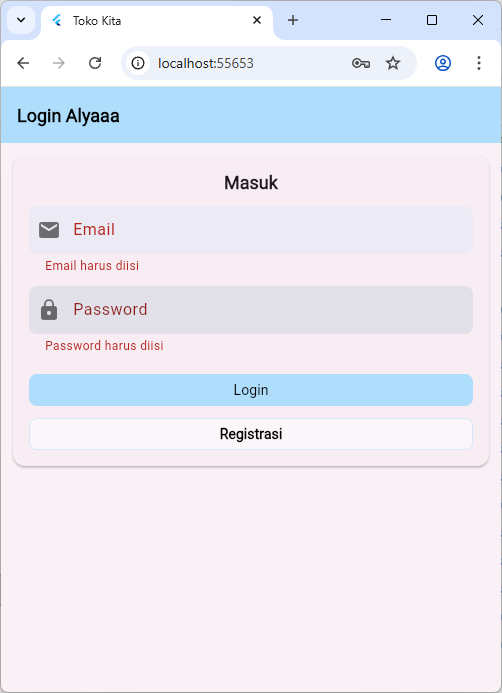

- Saat menekan tombol "Login", form divalidasi: jika kolom kosong tampil pesan kesalahan.

b. Popup Berhasil/Tidak

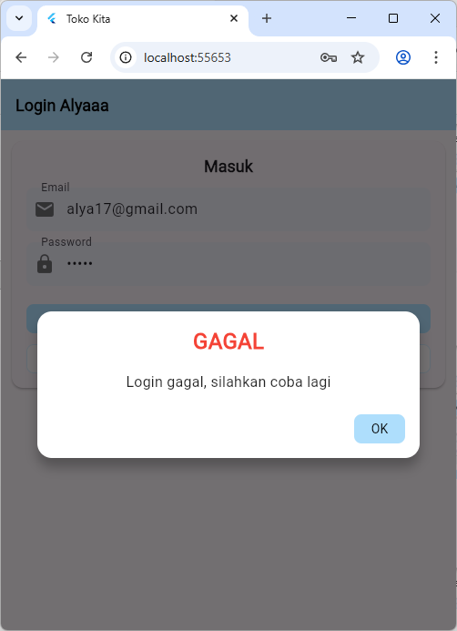

- Jika kredensial salah, tampil popup gagal dari `WarningDialog`.
- Jika berhasil, diarahkan ke halaman daftar produk.


### Halaman List Produk

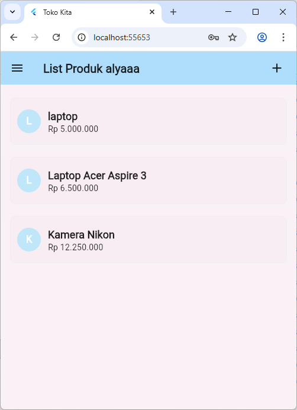

- Menampilkan list data produk yang diambil dari API.
- Setiap item tampil dalam Card dengan inisial, nama, dan harga (format Rupiah).
- Ketuk item untuk membuka halaman detail produk.


### Halaman Detail Produk

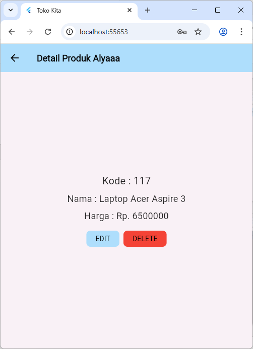

- Menampilkan detail nama dan harga produk.
- Tersedia tombol Edit untuk mengubah data dan Delete untuk menghapus.


### Proses Tambah Data Produk

a. Form Tambah Produk (isi & validasi)

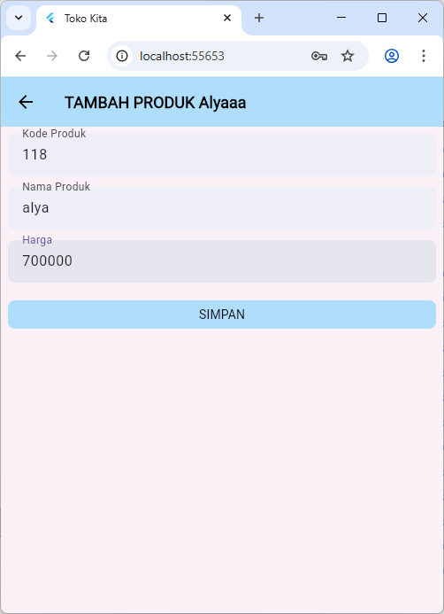

- Isi Kode Produk, Nama Produk, Harga.
- Jika isi form belumsesuai ketentuan.

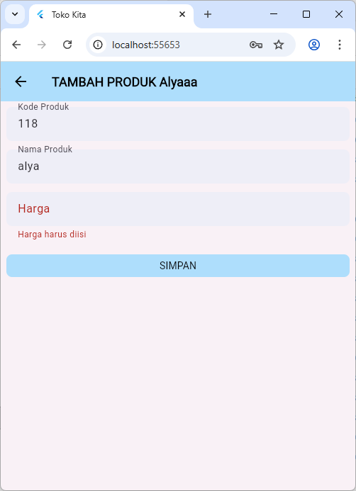

- Jika harga bukan angka, tampil popup peringatan:

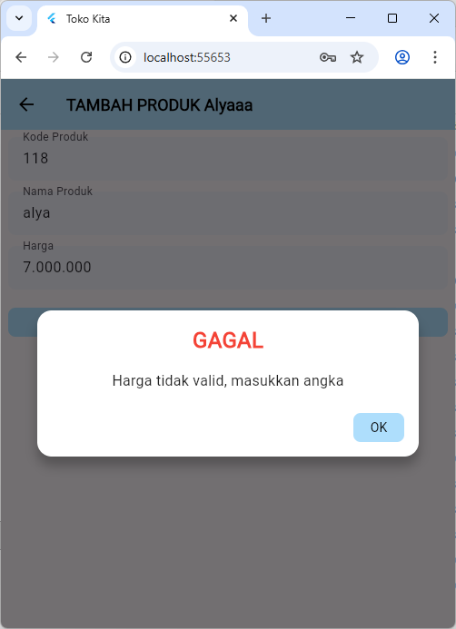


### Proses Ubah Data Produk

a. Form Ubah Produk

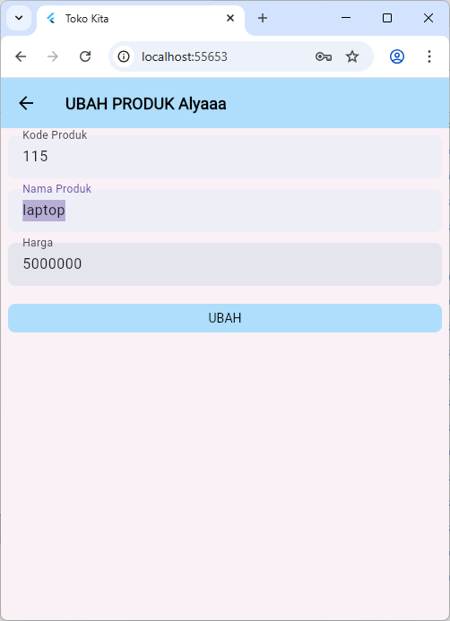

- Field terisi dari data produk sebelumnya; ubah nilai sesuai kebutuhan.
- Tekan tombol UBAH untuk menyimpan perubahan
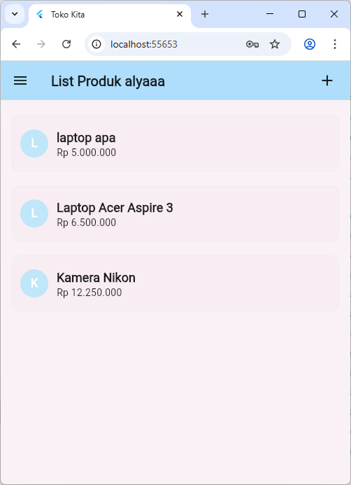


### Proses Hapus Data Produk

a. Konfirmasi Hapus pada Detail Produk

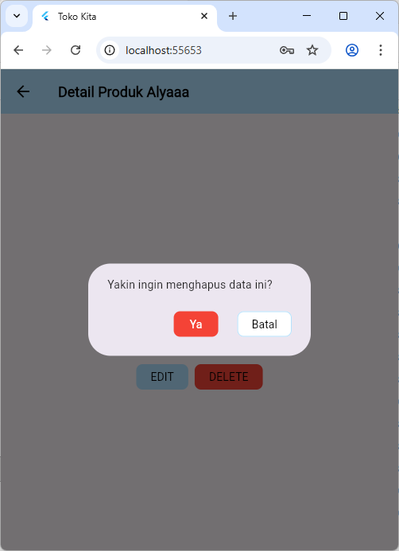

- Tekan DELETE di halaman detail, muncul dialog konfirmasi.
- Tekan Ya untuk menghapus; Batal untuk menutup dialog.


