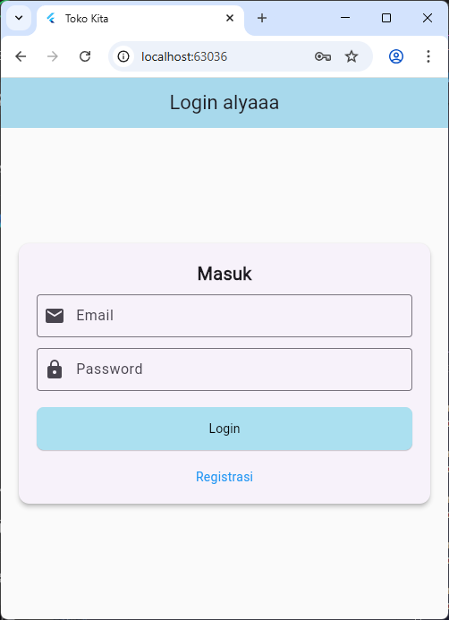
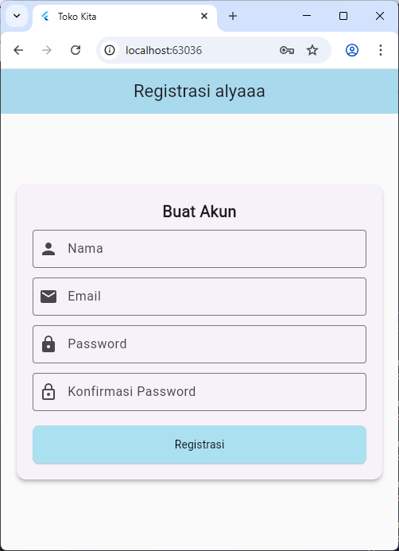
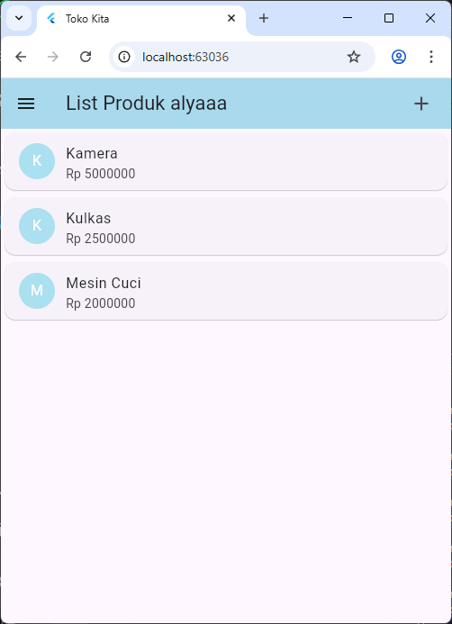
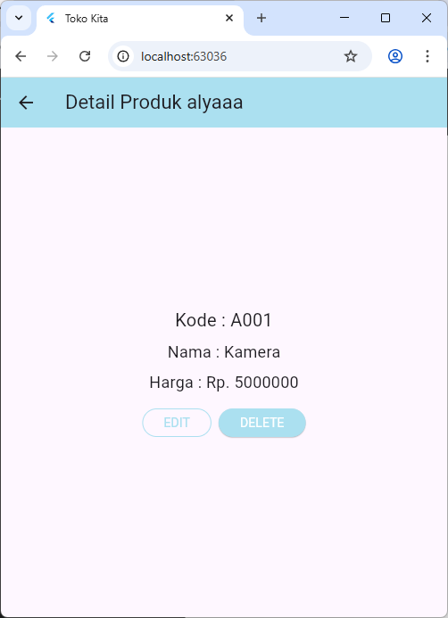
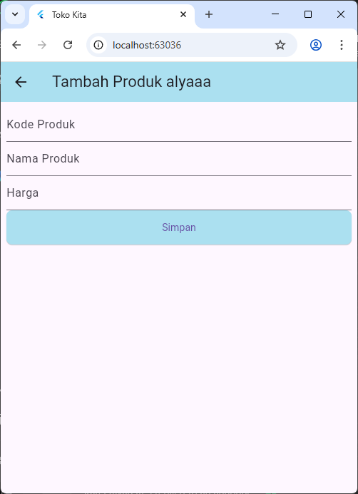
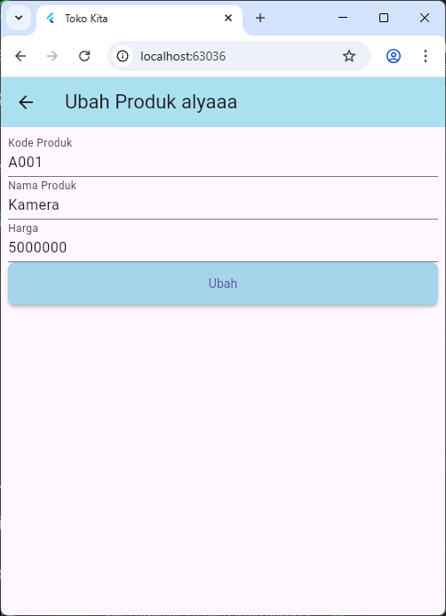

# TokoKita

Sellyjuan Alya R / H1D023006
Shift A/C

Ringkasan singkat
TokoKita — aplikasi demo toko (Flutter).


Fitur yang disertakan
- Halaman registrasi dan login (form, validasi sederhana)
- CRUD produk UI (tambah, ubah, list, detail)


Struktur penting
```
lib/
	main.dart
	model/
		login.dart
		registrasi.dart
		produk.dart
	ui/
		login_page.dart
		registrasi_page.dart
		produk_page.dart
		produk_form.dart
		produk_detail.dart
```


Tampilan :













"# TUGAS-8---PERTEMUAN-10-H1D023006" 
